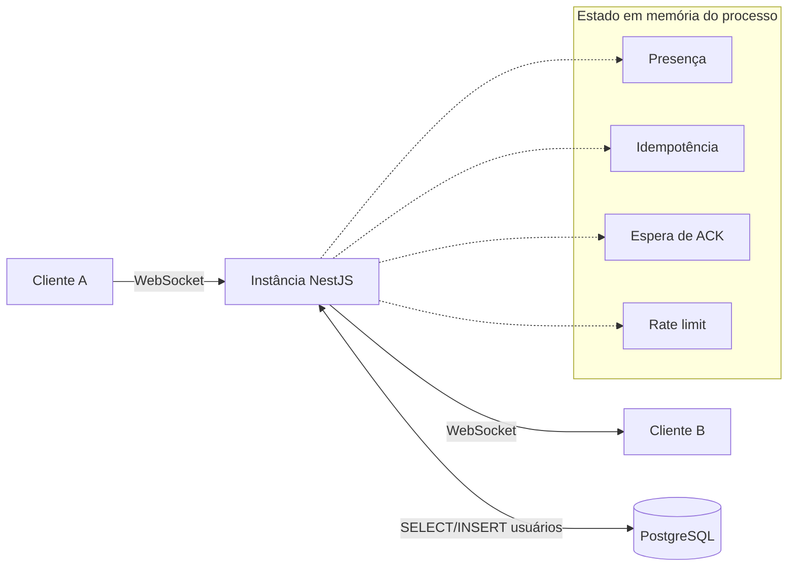

# P2P Chat API

API de chat individual (um-para-um) em tempo real, construída em NestJS.
Um usuário autenticado envia uma mensagem a outro usuário específico; o
servidor entrega via WebSocket e confirma ao remetente se a mensagem foi
entregue ou se o destinatário está offline.

```text
Usuário A → servidor NestJS → Usuário B
```

Não é WebRTC nem conexão direta entre dispositivos. "P2P" aqui significa
comunicação individual, sempre mediada pelo servidor.

## Fora de escopo

Salas, grupos, canais, entidade de conversa, histórico, inbox, upload de
arquivos, chamadas de áudio/vídeo, front-end completo. **Mensagens não são
persistidas**: existem apenas durante a transmissão via WebSocket.

## Arquitetura

Módulo NestJS = domínio. Cada domínio expõe só o que os outros precisam
consumir.

```text
src/
├── auth/         # cadastro, login, JWT, autenticação do handshake WS
├── users/        # perfil, listagem, consulta de usuários
├── chat/         # gateway WebSocket, envio/ack/timeout/idempotência
├── presence/     # online/offline, multi-dispositivo
├── health/       # health checks e métricas
├── common/       # guards, filters, decorators, interceptors, enums
├── config/       # validação de variáveis de ambiente
├── prisma/       # acesso ao PostgreSQL
├── app.module.ts
└── main.ts
```

**Decisão de arquitetura: instância única, sem Redis.** Presença,
idempotência, rate limiting e espera de ACK são estado efêmero em memória
do processo (`Map` + `setTimeout`), não em Redis. Trade-off: escala
verticalmente, não horizontalmente; um restart zera presença e ACKs
pendentes, o que é aceitável, já que nada disso é persistido por natureza
(a mensagem nunca foi para persistir, e a presença é sempre reconstruída
pelas reconexões).



## Stack

Node.js, TypeScript, NestJS, Socket.IO, PostgreSQL + Prisma (driver
adapter `pg`), JWT + Passport, bcrypt, class-validator/class-transformer,
Swagger, Jest, Docker/Docker Compose.

## Pré-requisitos

- Node.js 22+
- Docker e Docker Compose (para rodar via container ou só o Postgres)

## Instalação local

```bash
npm install
cp .env.example .env   # ajuste DATABASE_URL para localhost se rodar fora do Docker

# sobe só o Postgres, via docker compose
docker compose up -d postgres

npx prisma migrate deploy
npm run start:dev
```

A API sobe em `http://localhost:3000`, com Swagger em `/docs`.

## Execução com Docker

```bash
docker compose up --build
```

Sobe `app` (build multi-stage, roda `prisma migrate deploy` no start) e
`postgres`, ambos com healthcheck, em rede interna, com volume nomeado
para os dados do Postgres.

## Variáveis de ambiente

Ver [`.env.example`](.env.example). Resumo:

| Variável | Descrição |
|---|---|
| `DATABASE_URL` | Connection string do PostgreSQL |
| `JWT_SECRET` / `JWT_EXPIRES_IN` | Segredo e expiração do token |
| `CORS_ORIGIN` | Origem permitida (REST e WebSocket) |
| `MESSAGE_ACK_TIMEOUT_MS` | Prazo para o destinatário confirmar `message:ack` (padrão 5000) |
| `MESSAGE_IDEMPOTENCY_TTL_SECONDS` | Janela de deduplicação por `senderId+clientMessageId` (padrão 300) |
| `MESSAGE_RATE_LIMIT` / `MESSAGE_RATE_LIMIT_WINDOW_SECONDS` | Limite de mensagens WS por usuário (padrão 20/10s) |

## Migrações

```bash
npx prisma migrate dev --name <nome>   # cria e aplica uma nova migração (dev)
npx prisma migrate deploy              # aplica migrações pendentes (produção/CI)
npx prisma generate                    # regenera o client em src/generated/prisma
```

## Testes

```bash
npm run test         # unitários (mocks, sem I/O): 32 testes
npm run test:e2e     # e2e (Postgres real): 23 testes: auth, users, chat
npm run test:cov     # cobertura
```

Os testes e2e esperam um PostgreSQL alcançável via `DATABASE_URL` (o do
Docker Compose ou um container local, como no passo de instalação acima)
com as migrações aplicadas.

## Endpoints REST

Documentação completa e interativa em `/docs` (Swagger). Resumo:

| Método | Rota | Auth | Descrição |
|---|---|---|---|
| POST | `/auth/register` | não | Cadastro (nome, e-mail, senha) |
| POST | `/auth/login` | não | Login, retorna `{ accessToken, user }` |
| GET | `/users/me` | Bearer | Usuário autenticado |
| GET | `/users` | Bearer | Listagem paginada, busca por nome, exclui o próprio por padrão |
| GET | `/users/:id` | Bearer | Dados públicos + status online |
| GET | `/health` | não | Liveness |
| GET | `/health/ready` | não | Readiness (checa Postgres) |
| GET | `/metrics` | não | Métricas Prometheus |

## Eventos WebSocket

Handshake: JWT em `auth.token` ou header `Authorization: Bearer <token>`.

```text
Cliente A                    Servidor                    Cliente B
    |-- message:send -------->|                              |
    |                         |-- message:received --------->|
    |                         |<------- message:ack ----------|
    |<-- message:delivered ---|                              |
```

| Evento | Direção | Descrição |
|---|---|---|
| `message:send` | cliente para servidor | `{ clientMessageId, recipientId, content }` |
| `message:received` | servidor para destinatário | `{ messageId, clientMessageId, sender, content, sentAt }` |
| `message:ack` | destinatário para servidor | `{ messageId }` |
| `message:delivered` | servidor para remetente | `{ messageId, clientMessageId, recipientId, deliveredAt }` |
| `message:failed` | servidor para remetente | `{ clientMessageId, recipientId, code, message }`, `code`: `RECIPIENT_OFFLINE` ou `ACK_TIMEOUT` |
| `chat:error` | servidor para remetente | `{ requestId, clientMessageId?, code, message, details }` |
| `presence:check` | cliente para servidor | `{ userId }`, responde `{ userId, online }` (callback) |
| `presence:changed` | servidor para quem consultou | `{ userId, online }` |

### Fluxo de autenticação

1. `POST /auth/register` ou `/auth/login` retorna um JWT.
2. O cliente WS conecta com esse JWT no handshake.
3. Um middleware do Socket.IO (`server.use`, não `handleConnection`) valida
   o token **antes** de confirmar a conexão ao cliente, o que evita que
   uma mensagem emitida logo após `connect` chegue antes da autenticação
   terminar. Token inválido ou ausente: o cliente recebe `connect_error`,
   a conexão nunca se estabelece.
4. `senderId` de toda ação WS vem sempre do JWT (`socket.data.userId`),
   nunca de um campo do payload. Mesmo que o cliente envie um `senderId`
   forjado, ele é rejeitado (`chat:error VALIDATION_ERROR`, campo não
   esperado no DTO), nunca aceito.

### Fluxo de entrega

`message:send` passa por validação (rate limit, shape, idempotência,
destinatário existe, não é autoenvio) e então verifica se o destinatário
tem socket ativo:
- **Não**: `message:failed` (`RECIPIENT_OFFLINE`) imediato, sem esperar.
- **Sim**: `message:received` a todos os sockets do destinatário, mais um
  timer de `MESSAGE_ACK_TIMEOUT_MS`. Se `message:ack` chegar a tempo,
  `message:delivered`. Se não, `message:failed` (`ACK_TIMEOUT`).

Reenvio do cliente com o mesmo `clientMessageId` dentro de
`MESSAGE_IDEMPOTENCY_TTL_SECONDS` é tratado como duplicata (silenciosamente
ignorado, sem reentrega nem novo erro).

## Cliente de demonstração

[`examples/socket-client.html`](examples/socket-client.html): página HTML
única, sem build, para inspecionar o protocolo manualmente (conectar,
enviar, ver ACK/delivered/failed/erros). Não substitui os testes
automatizados.

## Limitações conhecidas

- Sem persistência de mensagens, histórico ou reenvio, por design.
- Instância única: sem Redis Adapter, sem coordenação entre múltiplos
  processos da API. Escala verticalmente.
- `presence:changed` só notifica quem chamou `presence:check` para aquele
  usuário; não há broadcast de presença global.

## Decisões e trade-offs

| Decisão | Por quê |
|---|---|
| Sem Redis, estado em memória | Simplicidade: instância única é suficiente para o escopo atual, com ponto de extensão documentado se precisar escalar |
| Prisma 7 com driver adapter (`@prisma/adapter-pg`) | Versão mais recente do Prisma, que exige adapter explícito para providers SQL |
| Idempotência só grava a chave após validações passarem | Uma tentativa que falha por payload inválido ou destinatário inexistente não "trava" o `clientMessageId`, o cliente pode corrigir e reenviar |
| Autenticação WS via middleware `io.use()`, não `handleConnection` | Elimina corrida entre o cliente considerar-se conectado e o servidor terminar de validar o JWT |
